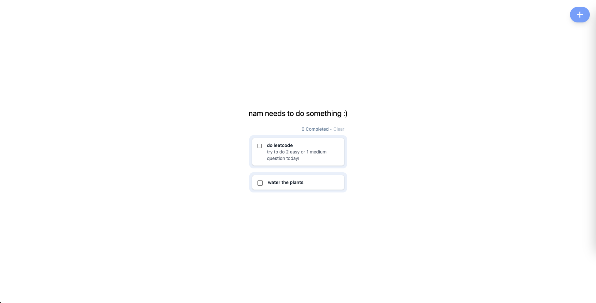

## Nam Needs TODO


> A full-stack MERN Todo App built with a modern stack and containerized for easy setup.

---

### Frontend
- [React.js](https://reactjs.org/) – for building interactive UIs
- [Tailwind CSS](https://tailwindcss.com/) – for utility-first styling
- [Axios](https://axios-http.com/) – for handling API requests
- [Vite](https://vitejs.dev/) – for fast frontend dev/build tool

### Backend
- [Node.js](https://nodejs.org/) – JavaScript runtime environment
- [Express.js](https://expressjs.com/) – lightweight web framework

### Database
- [MongoDB](https://www.mongodb.com/) – NoSQL document database
- [Mongoose](https://mongoosejs.com/) – ODM to interact with MongoDB in Node

---



---

### Requirements

Make sure you have [**Docker**](https://www.docker.com/products/docker-desktop) installed:
```bash
docker --version
```

---

### Run the Project
Clone the project and launch everything with Docker:
```bash
git clone https://github.com/namneyugn21/NamNeedsTODO.git

cd NamNeedsTODO

docker-compose up --build
```
Then open:
- Frontend: http://localhost:5173
- Backend API: http://localhost:3000/todos
- MongoDB is handled automatically inside Docker (no setup needed!)

---

### License

This project is open source and available under the [MIT License](LICENSE).
